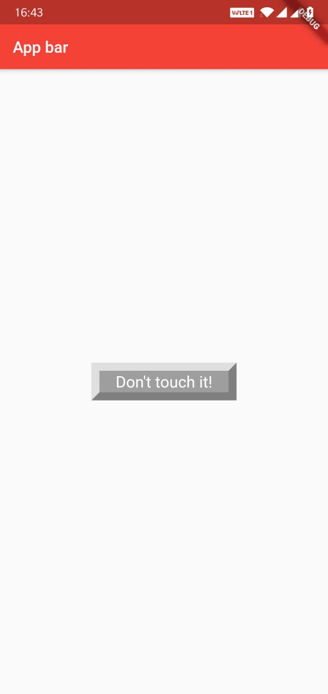
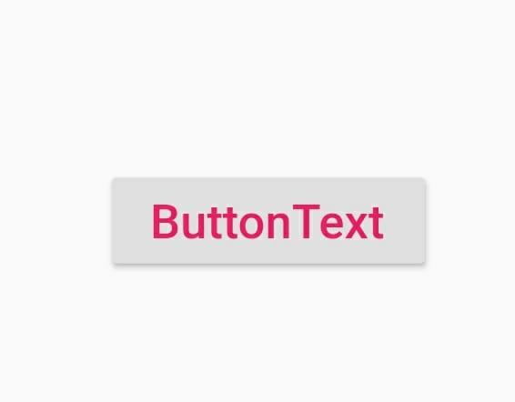
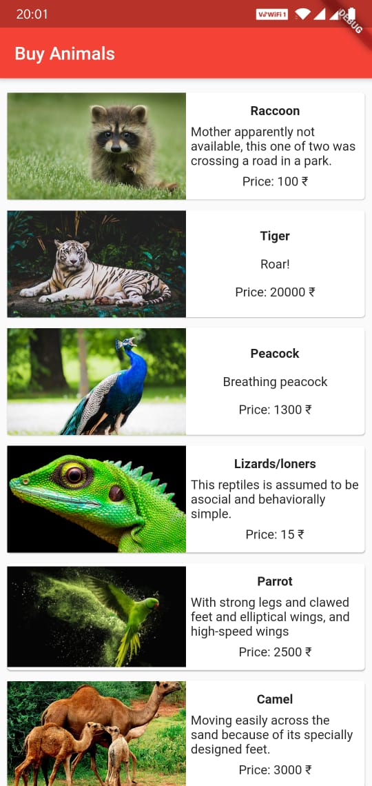

# layouts

In an application the visible widgets needs to layout where it gets placed. In this section we will see how to lay out a widget(place a widget appropriately which is visible in the application).

To lay out a widget we can use any one from the different types of **Layout widgets**, eg: Row, Column, Container, etc.

There are two types of layout widget:
- Single-child layout widgets: Widget supporting a single child
- Multi-child layout widgets: Widget supporting multiple child

## Single-child layout widgets

This will have only one widget as its child. Each of the widget in this category has a specific purpose it serves.

For example,
- `Align`, a widget that aligns its child within itself and optionally sizes itself based on the child's size.
- `Center`, a widget that centers its child within itself.
- `Container`, a widget that allows you to customize its child widget. Use a Container when you want to add padding, margins, borders, or background color, to name some of its capabilities.
- etc...

Single child widgets are great options to create high quality widget having single functionality such as button, label, etc.

**Example**
- Display a button.

A custom button class:
```dart
class MyButton extends StatelessWidget {
  MyButton({Key key}) : super(key: key);

  @override
  Widget build(BuildContext context) {
    return Container(
        child: Container(
            padding: const EdgeInsets.symmetric(horizontal: 20.0, vertical: 2.0),
            decoration: const BoxDecoration(
              border: Border(
                top: BorderSide(width: 10.0, color: Color(0xFFFFDFDFDF)),
                left: BorderSide(width: 10.0, color: Color(0xFFFFDFDFDF)),
                right: BorderSide(width: 10.0, color: Color(0xFFFF7F7F7F)),
                bottom: BorderSide(width: 10.0, color: Color(0xFFFF7F7F7F)),
              ),
              color: Colors.grey,
            ),
            child: const Text(
              'Don\'t touch it!',
              textDirection: TextDirection.ltr,
              textAlign: TextAlign.center,
              style: TextStyle(
                color: Colors.white,
                fontSize: 20,
              )
            ),
        ),
    );
  }
}
```
The above stateless widget when used inside any of the `MaterialApp` widget or `Scaffold` widget, then it would look something like this:



However, we can always use the already provided widgets for button. Eg: `RaisedButton`
```dart
RaisedButton(
  onPressed: () { print ('something'); },
  child: Text(
    'ButtonText',
    style: TextStyle(
      fontSize: 20,
      color: Colors.pink,
    ),
  ),
)
```
Which would look like:



There are many other widget classes already provided by flutter framework.

Now, coming to the `MyButton` example, there is a `Container` widget acting as the layout widget. **We have used its `padding` property to arrange its child widget by the given padding, here padding is provided by EdgeInsets class.**

To understand **padding** you can see this:


## Few important layout widgets for single child layout widgets:
- Padding
- Align: Align its child widget within itself using the value of `alignment` property.
    eg:
    ```dart
    Align(
        alignment: FractionalOffset(0.2, 0.6), child: Container(
            height: 40.0, width: 40.0, color: Colors.red,
        ), 
    ),
    ```
    - FractionalOffset(1.0, 0.0) represents the top right. i.e. `x` axis is at `0` and `y` axis is at `1`.
    - FractionalOffset(0.0, 1.0) represents the bottom left.


## Multi-child layout widgets

A given widget will have more than one child widgets and the layout of each widget is unique.

For example, Row widget allows the laying out of its children in horizontal direction, whereas Column widget allows laying out of its children in vertical direction.

Some of the frequently used widgets in this section:
- Row
- Column
- Stack
- ListView
- etc...

## Example application

View:



### Source code:

```dart

import 'package:flutter/foundation.dart';
import 'package:flutter/material.dart';

void main() {
  runApp(MyApp());
}

class MyApp extends StatelessWidget {
  // This widget is the root of your application.
  @override
  Widget build(BuildContext context) {
    return MaterialApp(
      title: 'Layout sample app',
      theme: ThemeData(
        primarySwatch: Colors.red,
      ),
      home: TheHomePage(title: "something"),
    );
  }

}

class TheHomePage extends StatelessWidget {

  final String title;

  TheHomePage({Key key, this.title}) : super(key: key);

  @override
  Widget build(BuildContext context) {
    return Scaffold(
      appBar: AppBar(
        title: Text("Buy Animals"),
      ),
      body: ListView(
        shrinkWrap: true,
        padding: EdgeInsets.fromLTRB(2.0, 10.0, 2.0, 10.0),
        children: getAnimalItems(key),
      ),
    );
  }

}


class ItemBox extends StatelessWidget {

  // write a constructor to accept the values to display on the item
  ItemBox({Key key, this.name, this.description, this.price, this.image}):super(key: key);

  final String name;
  final String description;
  final int price;
  final String image;

  @override
  Widget build(BuildContext context) {

    return Container(
      padding: EdgeInsets.all(2),
      height: 130,
      child: Card(
        child: Row(
          mainAxisAlignment: MainAxisAlignment.spaceEvenly,
          children: [
            Expanded(
              flex: 3,
              child: Image.asset(
                "assets/cardimages/"+image,
                fit: BoxFit.fitWidth,
              ),
            ),
            // adding image

            Expanded(
            flex: 3,
              child: Container(
                padding: EdgeInsets.all(5),
                child: Column(
                  mainAxisAlignment: MainAxisAlignment.spaceEvenly,
                  children: [
                    Text(this.name, style: TextStyle(fontWeight: FontWeight.bold),),
                    Text(this.description,),
                    Text("Price: "+this.price.toString()+" ₹",),
                  ],
                ),
              ),
            )
          ],
        ),
      ),
    );
  }
}

List<Widget> getAnimalItems(Key key) {
  List<ItemBox> animalItems = new List();
  animalItems.add(new ItemBox(
    key: key,
    name: "Raccoon",
    description: "Mother apparently not available, this one of two was crossing a road in a park.",
    price: 100,
    image: "img1.jpeg",)
  );
  animalItems.add(new ItemBox(key: key, name: "Tiger", description: "Roar!", price: 20000, image: "img2.jpeg",));
  animalItems.add(new ItemBox(key: key, name: "Peacock", description: "Breathing peacock", price: 1300, image: "img3.jpeg",));
  animalItems.add(new ItemBox(key: key, name: "Lizards/loners", description: "This reptiles is assumed to be asocial and behaviorally simple.", price: 15, image: "img6.jpg",));
  animalItems.add(new ItemBox(key: key, name: "Parrot", description: "With strong legs and clawed feet and elliptical wings, and high-speed wings", price: 2500, image: "img4.jpg",));
  animalItems.add(new ItemBox(key: key, name: "Camel", description: "Moving easily across the sand because of its specially designed feet.", price: 3000, image: "img5.jpg",));

  animalItems.add(new ItemBox(key: key, name: "Toucan", description: "a.k.a. an 'egg-sucker'", price: 150, image: "img7.webp",));
  animalItems.add(new ItemBox(key: key, name: "Fox", description: "A warm hearted friend for warm hearted people", price: 8000, image: "img8.jpeg",));
  animalItems.add(new ItemBox(key: key, name: "Meerkat", description: "Small mongoose found in southern Africa.", price: 600, image: "img9.jpeg",));
  animalItems.add(new ItemBox(key: key, name: "Kangaroos", description: "A large marsupials that is brought from Australia.", price: 13000, image: "img10.jpg",));
  return animalItems;
}

```

Most of the widgets used in the above app is already discussed, few which are not discussed are:

- Expanded: A widget that expands a child of a Row, Column, or Flex so that the child fills the available space. Using an Expanded widget makes a child of a Row, Column, or Flex expand to fill the available space along the main axis (e.g., horizontally for a Row or vertically for a Column). If multiple children are expanded, the available space is divided among them according to the flex factor.

- Flex: Flex is a widget as well as a property of Expanded widget known as flux factor (here we are discussing about the flex widget). The Flex widget displays its children in a one-dimensional array. The Flex widget allows you to control the axis along which the children are placed (horizontal or vertical).