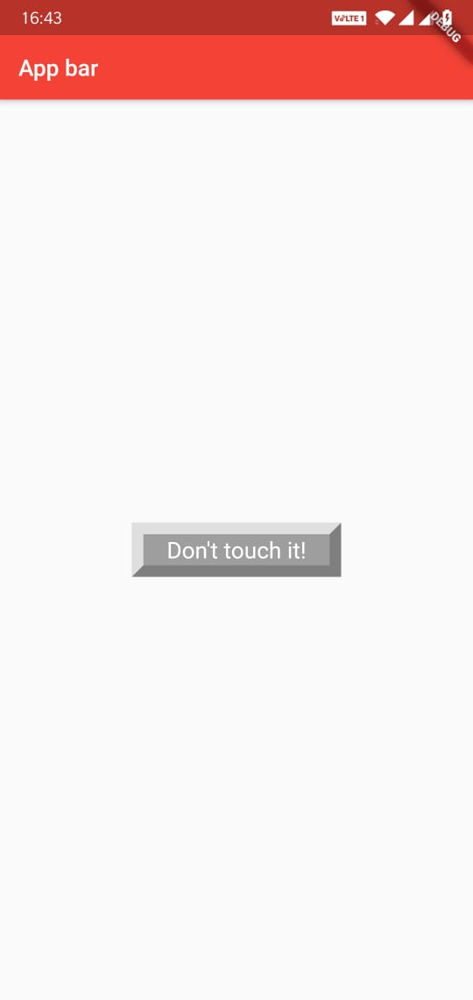
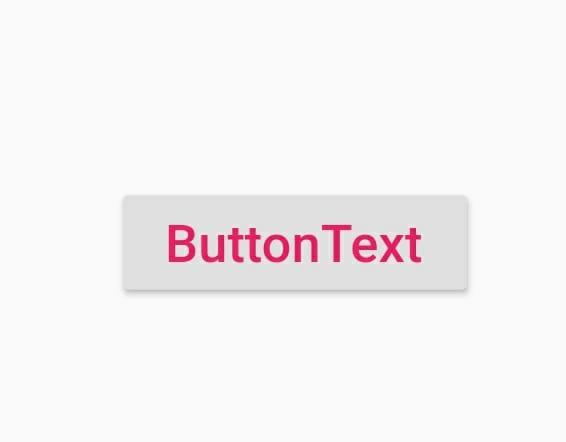

# layouts

In an application the visible widgets needs to layout where it gets placed. In this section we will see how to lay out a widget(place a widget appropriately which is visible in the application).

To lay out a widget we can use any one from the different types of **Layout widgets**, eg: Row, Column, Container, etc.

There are two types of layout widget:
- Single-child layout widgets: Widget supporting a single child
- Multi-child layout widgets: Widget supporting multiple child

## Single-child layout widgets

This will have only one widget as its child. Each of the widget in this category has a specific purpose it serves.

For example,
- `Align`, a widget that aligns its child within itself and optionally sizes itself based on the child's size.
- `Center`, a widget that centers its child within itself.
- `Container`, a widget that allows you to customize its child widget. Use a Container when you want to add padding, margins, borders, or background color, to name some of its capabilities.
- etc...

Single child widgets are great options to create high quality widget having single functionality such as button, label, etc.

**Example**
- Display a button.

A custom button class:
```dart
class MyButton extends StatelessWidget {
  MyButton({Key key}) : super(key: key);

  @override
  Widget build(BuildContext context) {
    return Container(
        child: Container(
            padding: const EdgeInsets.symmetric(horizontal: 20.0, vertical: 2.0),
            decoration: const BoxDecoration(
              border: Border(
                top: BorderSide(width: 10.0, color: Color(0xFFFFDFDFDF)),
                left: BorderSide(width: 10.0, color: Color(0xFFFFDFDFDF)),
                right: BorderSide(width: 10.0, color: Color(0xFFFF7F7F7F)),
                bottom: BorderSide(width: 10.0, color: Color(0xFFFF7F7F7F)),
              ),
              color: Colors.grey,
            ),
            child: const Text(
              'Don\'t touch it!',
              textDirection: TextDirection.ltr,
              textAlign: TextAlign.center,
              style: TextStyle(
                color: Colors.white,
                fontSize: 20,
              )
            ),
        ),
    );
  }
}
```
The above stateless widget when used inside any of the `MaterialApp` widget or `Scaffold` widget, then it would look something like this:



However, we can always use the already provided widgets for button. Eg: `RaisedButton`
```dart
RaisedButton(
  onPressed: () { print ('something'); },
  child: Text(
    'ButtonText',
    style: TextStyle(
      fontSize: 20,
      color: Colors.pink,
    ),
  ),
)
```
Which would look like:


There are many other widget classes already provided by flutter framework.

Now, coming to the `MyButton` example, there is a `Container` widget acting as the layout widget. We have used its `padding` property to arrange its child widget by the given padding, here padding is provided by EdgeInsets class.

To understand padding you can see this:

